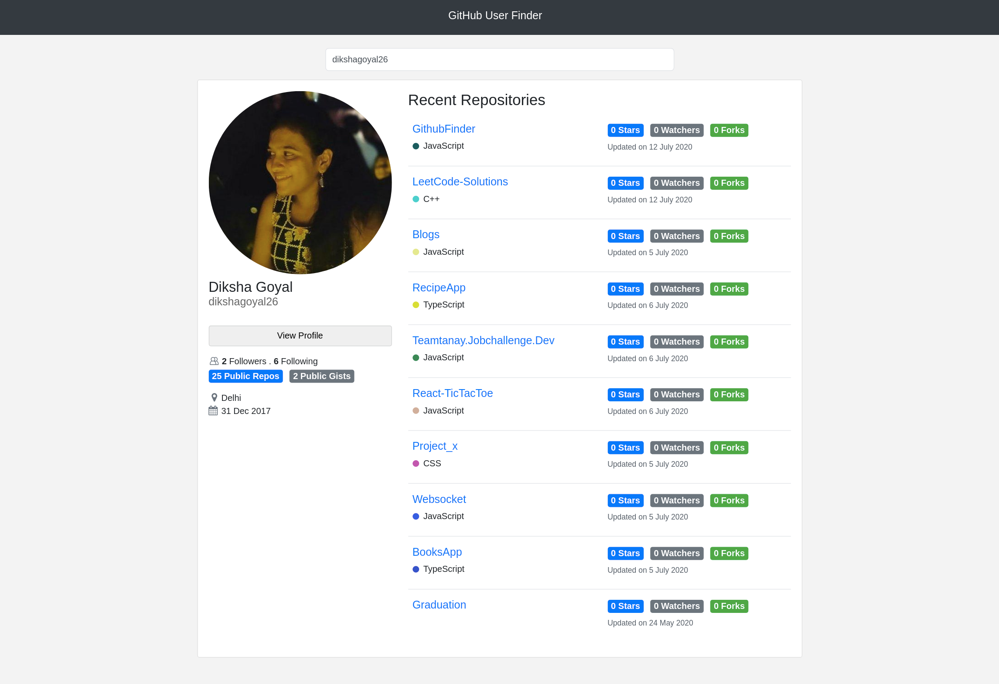

# Github User Finder

Github User finder is a webapp to find github users on the basis of their github handle. It displays user’s public github information and top 10 repositories of the user. Concept of debouncing is used while fetching books.

